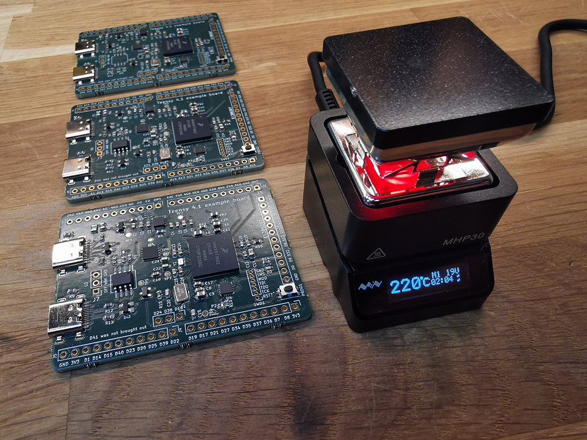

# Teensy 4.1 Kicad example project
Kicad files to make a custom Teensy 4.1, based on the official Teensy schematics, but exposing all pins for testing. All the 55 pins except D41 are brought out for testing. I'm using a USB Type C receptacle rather than USB Micro / A connectors. Don't forget that you'll need to buy the MKL02Z32VFG4 from PJRC for this to work. Also - be sure to scroll down on the MKL02Z32VFG4 page. There are [lots of important information there](https://www.pjrc.com/store/ic_mkl02_t4.html) on power sequencing and layout.

## Know bugs
This version is tested and works, but the MAX1562 that I used for the USB switch has inverted polarity from what is expected. You can get around this by using the alternate part MAX1563, or something else. Only reason I went with this 4A chip is the parts shortage.

I just removed the chip and soldered bodge-wires to bypass it. This also works, but I guess it then lacks protection. I've tested with keyboard & mouse.

## Features

The board includes the required parts

- MIMXRT1062DVJ6B (Arm Cortex M7 @ 600 Mhz)
- MKL02Z32VFG4 (must be purchased from PJRC)
- W25Q64JVXGIM (8Mb spi Flash)

Optional parts (not in PJRC's design)

- [USB Type C](https://github.com/jenschr/USB-C-Connectors) for power & debug
- USB Type C host port with MAX1562 for power control
- 2.54mm pin header connections for all pins but D41
- JTAG pins broken out (not tested, but there)

Not included (from PJRC's design)
- Extra SpiFlash or PSRAM
- Ethernet

Note: the schematic symbol for the IMXRT1062 chip is really clumsy and makes the schematic more complex than required, but that's what you get if you use SamacSys Library Loader rather than making the symbol yourself.

## Picture
Here's a picture of the boards when I soldered them:

